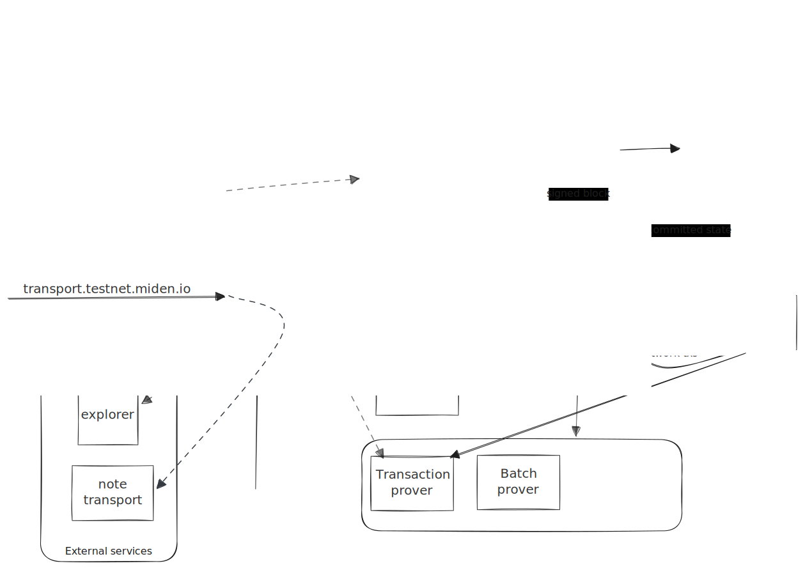

# Overview

This guide covers the infrastructure operated by the network operator and the validator dependency it coordinates with.
These services advance the network, build network transactions, produce proofs, expose RPC capacity, and monitor the
deployment.

A Miden network is organized around a single sequencer node. The sequencer owns canonical network progression and
coordinates with the validator and trusted internal services. Public traffic should be routed through load balancers in
front of full nodes and prover workers; non-public services such as the validator and network transaction builder should
not be exposed directly.

## Example Architecture

The public entry points are the gRPC RPC API and the gRPC prover API. Each entry point has its own load balancer: RPC
requests fan out to full nodes, while prover requests fan out to prover workers.

Full nodes sit between public RPC clients and the sequencer. They sync blocks and proofs from the sequencer, serve
queries from local state, provide block and proof subscriptions, and forward submitted transactions upstream until they
reach the sequencer.

The network monitor observes the deployment from the outside. It can check RPC freshness, validator status, prover
status, explorer and faucet availability, note transport, and end-to-end network transaction behavior.

## Components and Roles

### Sequencer

The sequencer runs `miden-node sequencer`. It is the centralized block producer for the network. It accepts submitted
transactions through RPC, batches transactions, proposes blocks, coordinates block signing with the validator, and
publishes the resulting block stream for full nodes to sync from.

Only the network operator should run a sequencer for an official network. Node runners should run full nodes.

### Full Nodes

Full nodes run `miden-node full`. They replicate the chain from an upstream RPC source and serve the public RPC API from
local state. A deployment can run multiple full nodes behind an RPC load balancer to scale query throughput and isolate
the sequencer from public traffic.

Full nodes also support block and proof subscriptions. These streams are useful for indexers, explorers, monitoring
systems, and downstream full-node fan out.

### Validator

The validator runs `miden-validator`. It independently verifies proposed blocks before they can be committed and signs
the blocks it accepts. On official networks, it is operated by a separate entity from the network operator. For
unofficial or private networks, this separation matters less and the validator can be run as an internal service.

The validator is not a consensus participant in a decentralized validator set. It is part of the current network
architecture's block verification and recovery path.

### Network Transaction Builder

The network transaction builder runs `miden-ntx-builder`. It follows committed blocks, tracks network notes, constructs
network transactions, proves them through a remote transaction prover, and submits them through an RPC node.

This service is internal. RPC nodes use it to answer network-note status queries, and it uses the same upstream RPC path
as other transaction submitters when sending proven transactions.

### Remote Provers

Remote provers run `miden-remote-prover`. They move expensive proof generation onto dedicated workers. A prover instance
is configured for one proof kind: transaction, batch, or block.

The prover API can be exposed through a separate load balancer when external clients need proof generation capacity.
Sequencer and NTX builder deployments can also use internal prover pools for batch, block, and network-transaction
proofs.

### Network Monitor

The network monitor runs `miden-network-monitor`. It is an observer and test client for network health. It is not
required for block production, but it gives operators a single place to check whether RPC, validator, prover, faucet,
explorer, note transport, and network-transaction flows are behaving as expected.
